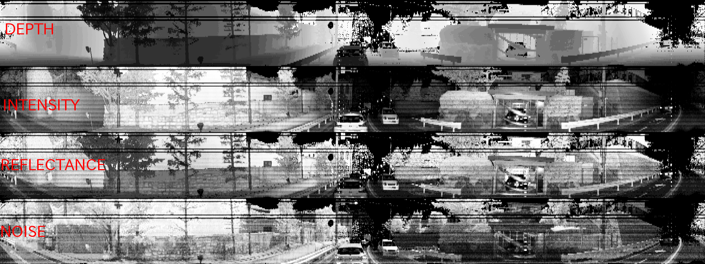
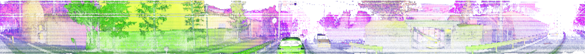

# lidar_cloud_to_image
Conversion from 3D LiDAR pointcloud to images


This work was inspired on `cloud_to_image` from I. Bogoslavskyi, C. Stachniss, University of Bonn 
https://github.com/PRBonn/cloud_to_image.git

## Operation
Several 3D LiDARs are supported:
- Velodyne: HDL-64-S2, HDL-64-S3, HDL-32, VLP-32, VLP-16
- Ouster: OS-1-16, OS-1-64 (both in 512, 1024 and 2048 modes)

Several pointclouds are supported:
- XYZ
- XYZI
- XYZIR
- XYZIF
- XYZIRF
- XYZIFN
- XYZIRFN

(I=intensity, R=ring, F=reflectivity, N=ambient noise)

Several image output modes supported, depending on the pointcloud type:
- SINGLE: each image is independent
- GROUP: all images are grouped into one
- STACK: all images are combined one per channel
- ALL: single images + group images + stack images will be published

Examples:
- Group image for pointcloud type `XYZIFN`:


- Stack image for pointcloud type `XYZIFN`:


## How to build
1. Create a ROS workspace (if necessary):
```
mkdir ~/wkspace-cloud2image/src -p
cd ~/wkspace-cloud2image/src
catkin_init_workspace
```

2. Clone this repository:
```
cd ~/wkspace-cloud2image/src
git clone https://github.com/alexandrx/lidar_cloud_to_image.git
```

3. Build it:
```
cd ~/wkspace-cloud2image/
catkin build
```

## How to run
The following is an example how to generate images for an Ouster OS-1-64 in 2048x10 mode, pointcloud type XYZIFN, output all images in 8bpp, with histogram equalization and horizontal flipped, images resized 3x in vertical.
```
roslaunch lidar_cloud_to_image cloud2image.launch sensor_model:="OS-1-64-2048" point_type:="XYZIFN" v_scale:=3.0 output_mode:="ALL" 8bpp:=true equalize:=true flip:=true
```
To show the group-mode image:
```
rosrun image_view image_view image:=/c2i_group_image
```
And to show the stack-mode image:
```
rosrun image_view image_view image:=/c2i_stack_image
```

## Todo
- [x] Documentation
- [] VLS-128 support (more testing needed)
- [] Correct odd black horizontal lines
- [] Add HESAI Pandar64, Pandar40, and Pandar40p support
- [] Add Robosense RSLidar32 support
